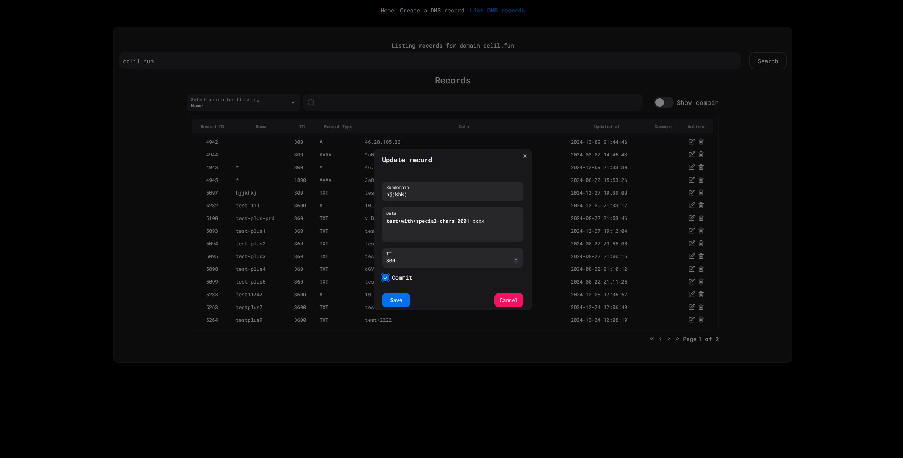

# Better WAPI WebApp

A web frontend for [Better WAPI](https://github.com/Loupeznik/better-wapi)


## Running

```bash
git clone https://github.com/Loupeznik/better-wapi-webapp

npm install -g pnpm
pnpm install

pnpm run dev
```

## Building and configuration

Build the project with `pnpm run build`. The output will be in the `dist` folder.

```bash
pnpm install
pnpm run build
```

Then edit the `dist/config.json` file and set the `API_BASE_URL` to the BaseURL of your [Better WAPI](https://github.com/Loupeznik/better-wapi) instance.

## Screenshots

Create a record


Update a record



List records


